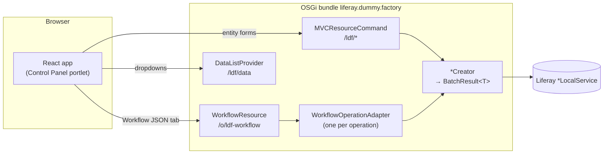

# Architecture overview

How the pieces of Dummy Factory fit together. Read this first; [`backend.md`](backend.md) and [`frontend.md`](frontend.md) go one level deeper.

## Repository layout

```
liferay-dummy-factory/                 Liferay Workspace (Gradle)
├── modules/liferay-dummy-factory/     the only OSGi bundle: portlet + REST API + React UI
│   ├── src/main/java/…/tools/
│   │   ├── portlet/                   MVCPortlet, PanelApp, ResourceBundleLoader
│   │   ├── portlet/actions/           one MVCResourceCommand per entity (/ldf/*)
│   │   ├── service/                   *Creator, *BatchSpec, BatchResult, value objects
│   │   ├── service/datalist/          DataListProvider SPI implementations (dropdown data)
│   │   ├── service/usecase/           Creator + non-fatal enrichment (User, Site)
│   │   ├── workflow/                  workflow engine, references, validation
│   │   ├── workflow/adapter/          one WorkflowOperationAdapter per operation
│   │   ├── workflow/jaxrs/            JAX-RS app mounted at /o/ldf-workflow
│   │   ├── basicauth/, sap/           test-only components (inactive without a .config)
│   │   └── utils/                     BatchTransaction, ScreenNameSanitizer, progress, …
│   ├── src/main/resources/
│   │   ├── META-INF/resources/        view.jsp, init.jsp, js/ (React + TypeScript), css/
│   │   └── content/Language.properties
│   ├── src/test/java/                 JUnit 5 host-JVM unit tests
│   ├── test/                          Vitest unit tests (setup.ts, js/)
│   └── scripts/build.mjs              esbuild production bundle
├── integration-test/                  Spock + Playwright specs against a DXP container
│   └── src/test/resources/workflow-samples/   sample workflows shared with the UI
├── configs/common/                    portal-ext.properties and OSGi .config baked into the image
├── latest/                            released JAR for this branch's DXP version
└── docs/                              this documentation
```

## Runtime components



There are two entry points that create data, and both converge on the same `*Creator` classes:

| Entry point | Used by | Request shape | Response shape |
|---|---|---|---|
| `MVCResourceCommand` `/ldf/<entity>` | the per-entity forms in the portlet | form POST with a JSON `data` parameter | `{success, count, requested, skipped, items, error?}` |
| JAX-RS `/o/ldf-workflow/{plan,execute,schema,functions}` | the Workflow JSON tab, scripts, tests | workflow JSON ([contract](../reference/workflow-api.md)) | plan / execution result with one step result per step |

Because both paths call the same Creator and return the same item fields, a workflow step and a form submission are interchangeable. Keeping them that way is a rule: see [RC ↔ adapter field parity](../reference/workflow-api.md#rc--workflow-adapter-field-parity).

## Request flow: a form submission

1. `view.jsp` renders a `<portlet:resourceURL>` per command and passes the URL map to the React `App` as `actionResourceURLs`. It also injects the portlet's resource bundle into `Liferay.Language._cache` ([why](frontend.md#i18n-two-resolution-paths)).
2. The user submits an entity form. `EntityForm` posts to the command's resource URL.
3. The `*ResourceCommand` delegates to `PortletJsonCommandTemplate.serveJsonWithProgress`, parses and validates parameters, builds value objects (`BatchSpec`, `*BatchSpec`), and calls the Creator.
4. The Creator loops over the batch, creating each entity in its own transaction (`BatchTransaction.run`), and returns a `BatchResult<T>`.
5. `ResourceCommandUtil.toJson` turns the result into the wire contract; the UI's `parseResponse` renders it in `ResultAlert`. Long batches report progress through `/ldf/progress`.

Details of steps 3–5: [`backend.md`](backend.md).

## Request flow: a workflow

1. The client posts a workflow (ordered steps, each naming an `operation` and its parameters) to `/plan` (validate only) or `/execute`.
2. `WorkflowResource` validates shape and semantics (unknown operations, bad `from` references, missing required parameters).
3. `WorkflowEngine` runs steps in order. Each step's `from` references are resolved against the workflow input and earlier step results.
4. Each operation is a `WorkflowOperationAdapter` OSGi service. It builds the same `*BatchSpec` the resource command would, calls the Creator, and normalizes the `BatchResult` with `WorkflowResultNormalizer`.

Contract, reference syntax and samples: [`reference/workflow-api.md`](../reference/workflow-api.md). User-facing tutorial: [`guides/workflows.md`](../guides/workflows.md).

## Platform constraints that shape the code

These are facts about Liferay DXP, not choices. Each is explained once in the linked reference.

| Constraint | Consequence | Where it is documented |
|---|---|---|
| DXP 2026 runs the Jakarta Portlet 4.0 API | `jakarta.portlet.*` imports, `jakarta.portlet.version=4.0`; JSP taglib URI stays `http://xmlns.jcp.org/portlet_3_0` | [ADR-0008](../adr/0008-dxp-2026-migration.md) |
| The OSGi runtime does not export `javax.servlet` | `bnd.bnd` excludes it from `Import-Package` | [liferay-dxp-api](../reference/liferay-dxp-api.md#bndbnd-must-exclude-javaxservlet) |
| `release.dxp.api` with `version: "default"` floats to the newest release | the API dependency has no version; the target platform pins it | [liferay-dxp-api](../reference/liferay-dxp-api.md#releasedxpapi-never-pin-version-default) |
| Custom esbuild bundles bypass Liferay's JS language-key rewriting for variable keys | `view.jsp` injects language keys at runtime | [frontend.md](frontend.md#i18n-two-resolution-paths) |
| The DXP image hardens BasicAuth and JSONWS off | test-only components and `configs/common/` re-enable them for the test container | [dxp-runtime-config](../reference/dxp-runtime-config.md) |

## Test architecture

| Layer | Tool | Location | Runs on |
|---|---|---|---|
| Java unit | JUnit 5 + JaCoCo | `modules/liferay-dummy-factory/src/test/java` | host JVM, no Liferay |
| Frontend unit | Vitest + Testing Library (jsdom) | `modules/liferay-dummy-factory/test` | Node |
| Integration / E2E | Spock + Playwright (Chromium) | `integration-test/` | real DXP container started by the Workspace plugin |

How to run them: [`guides/testing.md`](../guides/testing.md). How the harness works: [`reference/test-harness.md`](../reference/test-harness.md).
